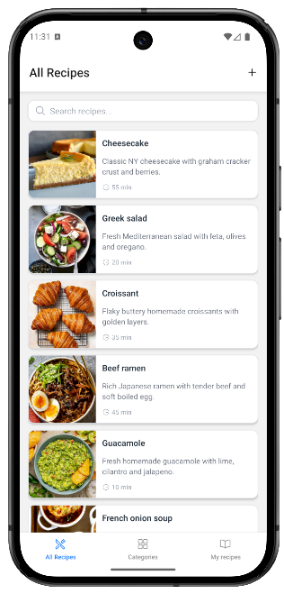

# 🍽️ Foodie

A full-stack mobile recipe app built with React Native and Node.js. Browse recipes, create your own, upload photos, and share with the community.

---

## 📱 Screenshots



---

## 📲 Try the App

Scan the QR code below with **Expo Go** (available on Android and iOS):


> ⚠️**Note:** Backend may take 30–50 seconds to wake up on the first request (free Render tier limitation).

## 🔑 Demo Account

> **Quick Test Account:** If you don’t want to create your own account, you can log in directly using:
>
> - **Username:** `markodemo`
> - **Password:** `Markodemo1-`

## ✨ Features

- Browse all public recipes with search
- View full recipe details — ingredients, instructions, servings, cook time
- Add, edit and delete your own recipes
- Upload recipe photos from camera or gallery
- Filter recipes by category
- Mark recipes as private
- JWT authentication — register and login
- Persistent login with secure token storage

---

## 🛠️ Tech Stack

**Mobile**

- React Native (Expo)
- TypeScript
- NativeWind (Tailwind CSS)

**Backend**

- Node.js
- Express.js
- PostgreSQL
- JWT Authentication
- Cloudinary (image upload)

**Infrastructure**

- Database: [Supabase](https://supabase.com)
- Backend: [Render](https://render.com)
- Mobile builds: [EAS Build](https://expo.dev)

---

## 🚀 Getting Started

### Prerequisites

- Node.js
- Expo CLI
- Expo Go app on your phone

### Clone the repo

```bash
git clone https://github.com/gjanjic/foodie.git
cd foodie
```

### Run the backend

```bash
cd backend
npm install
npm start
```

### Run the mobile app

```bash
cd mobile
npm install
npx expo start
```

Scan the QR code in the terminal with Expo Go.

## 🔐 Environment Variables

_For environment variables and local setup, feel free to reach out._

## 📁 Project Structure

## 🌐 API Endpoints

| Method | Endpoint             | Description                | Auth |
| ------ | -------------------- | -------------------------- | ---- |
| POST   | `/register-user`     | Register new user          | No   |
| POST   | `/login-user`        | Login                      | No   |
| GET    | `/me`                | Get current user           | Yes  |
| GET    | `/recipes`           | Get all public recipes     | No   |
| GET    | `/recipe/:id`        | Get single recipe          | No   |
| POST   | `/recipe`            | Create recipe              | Yes  |
| PUT    | `/recipe/:id`        | Update recipe              | Yes  |
| PUT    | `/delete-recipe/:id` | Soft delete recipe         | Yes  |
| GET    | `/categories`        | Get all categories         | No   |
| POST   | `/upload`            | Upload image to Cloudinary | Yes  |

---

## 👤 Author

**Gabriel Janjić**  
[GitHub](https://github.com/gabrieljanjic)
